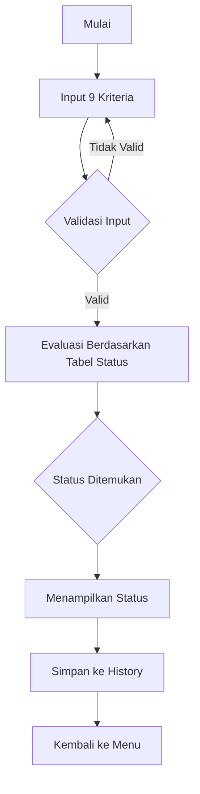

# SPPSGP
Rekontruksi dari project semester 1 yang berjudul Simulator Penentu dan Pencatat Status Gunung Berapi
# Simulator Penentu dan Pencatat Status Gunung Berapi

Aplikasi ini dibuat sebagai alat simulasi untuk menentukan status aktivitas gunung berapi berdasarkan sembilan kriteria pemantauan. Program juga mencatat seluruh hasil pengecekan setiap jam dan menyediakan fitur untuk melihat data historis serta melakukan reset pada data tersebut.

---

## 1. Deskripsi Proyek

Pemantauan gunung berapi berperan penting sebagai bagian dari sistem peringatan dini untuk meminimalkan dampak bencana. Aplikasi ini mensimulasikan proses penentuan status gunung berapi dengan menerima input dari pengguna, mengevaluasinya berdasarkan kriteria baku, lalu menyimpannya sebagai catatan harian.

Program memiliki tiga menu utama:

* **Cek Status**
* **Lihat History Status**
* **Reset**

---

## 2. Kriteria Penentuan Status Gunung Berapi

Penentuan status dilakukan berdasarkan sembilan kriteria berikut:

| Kriteria            | NORMAL (I) | WASPADA (II) | SIAGA (III) | AWAS (IV) |
| ------------------- | ---------- | ------------ | ----------- | --------- |
| Magnitudo Gempa     | < 2.9      | 2.9 – 3.9    | 4.0 – 5.2   | > 5.2     |
| Awan Panas          | Tidak      | Ya           | Ya          | Ya        |
| Suhu                | 0 – 32°C   | 33 – 37°C    | 38 – 40°C   | > 40°C    |
| Kelembapan          | 15 – 35%   | 10 – 14%     | 5 – 9%      | 0 – 4%    |
| Gas Berbahaya       | Tidak      | Ya           | Ya          | Ya        |
| Lahar Letusan       | Tidak      | Tidak        | Tidak       | Ya        |
| Lava                | Tidak      | Tidak        | Ya          | Ya        |
| Lontaran Batu Pijar | Tidak      | Tidak        | Ya          | Ya        |
| Hujan Abu           | Tidak      | Tidak        | Ya          | Ya        |

Data input harus sesuai dengan rentang valid setiap kriteria.

---

## 3. Alur Penentuan Status (Flowchart)



---

## 4. Menu Utama

### 4.1 Menu Cek Status

Pada menu ini pengguna memasukkan sembilan nilai kriteria. Jika seluruh input valid, program menentukan status aktivitas gunung berapi: **NORMAL**, **WASPADA**, **SIAGA**, atau **AWAS**.

Selain status, program juga menampilkan pesan rekomendasi tindakan lanjutan sesuai tingkat bahaya.

Data disimpan dalam format:

```
Magnitudo;AwanPanas;Suhu;Kelembapan;Gas;Lahar;Lava;BatuPijar;HujanAbu;Status;
```

Contoh:

```
5.3;ya;41;1;ya;ya;ya;ya;ya;AWAS_Level_IV;
```

---

### 4.2 Menu Lihat History Status

Menu ini menampilkan seluruh data status gunung berapi dari jam 01.00 hingga 24.00.

Pengguna dapat memilih:

* Menampilkan seluruh data beserta jam pencatatan, atau
* Menampilkan data pada jam tertentu.

Contoh format tampilan:

```
Pukul 1 : 6.5;ya;49;1;ya;ya;ya;ya;ya;AWAS_Level_IV;
Pukul 2 : 6.4;ya;41;2;ya;ya;ya;ya;ya;AWAS_Level_IV;
```

---

### 4.3 Menu Reset

Fitur ini digunakan untuk menghapus seluruh data history yang tersimpan. Reset biasanya dilakukan sebelum memulai pencatatan hari berikutnya.

Jika data diakses saat kosong, program menampilkan:

```
Undefined
```


## 5. Lisensi

Proyek ini dibuat sebagai tugas akademik dan dapat digunakan untuk tujuan pembelajaran.
